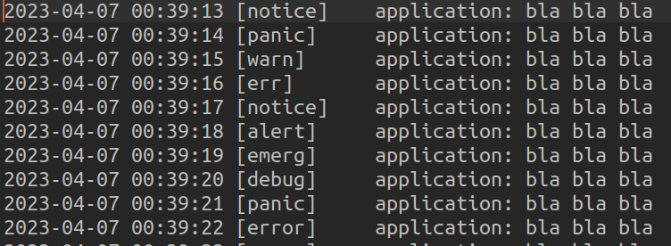
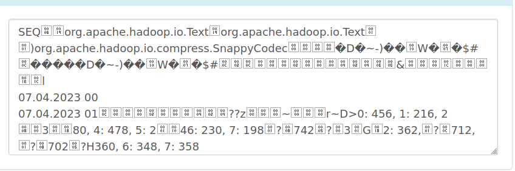
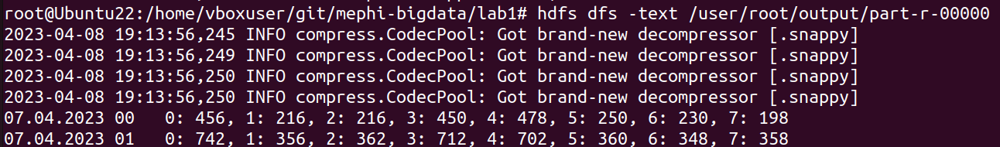

# Lab 1
## Задание

- Программа должна вычислять количество сообщений различной значимости
  (справочник обозначений: 7 – debug, 6 – info, 5 – notice, 4 - warning, warn, 3 - err, error,
  2 - crit, 1 - alert,  0 - emerg, panic) в syslog Linux с почасовой гранулярностью
- OutputFormat: SequenceFile со Snappy сжатием (плюс команда просмотра содержимого сжатого 
  файла посредством распаковки). Приложить скриншот просмотра сжатого контента
- Дополнительное требование: Использование нескольких input-файлов при старте 
  MapReduce-программы

## Запуск


```bash
sbt assembly
./startup.sh
```

## Сгенерировать входные данные

```bash 
./generateInputData.sh log_entries_count output_file_name
```

## Тесты

```bash
sbt test
```

## Конфигурация

- Ubuntu 22.04
- Scala 2.13.10
- sbt 1.8.2
- JDK 11
- Hadoop 2.10.2

## Выполнение

Генерируются такие входные данные:



После исполнения задачи в HDFS сохраняется результат:


Просмотр распакованного sequence файла:

